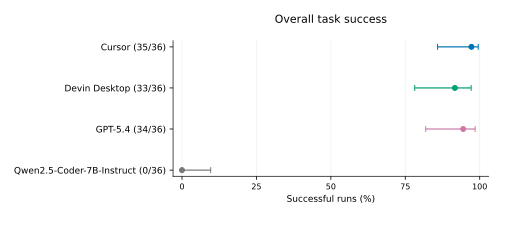
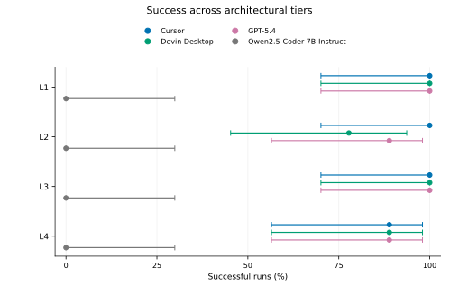
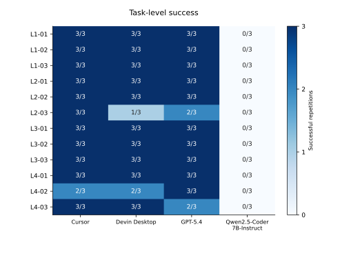
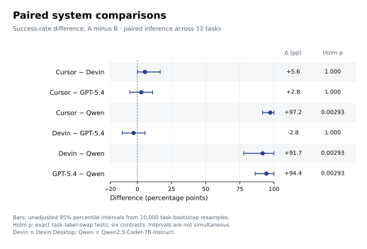

# Core success results — stage 1

This stage covers overall, tier and task success plus the six planned pairwise comparisons. All figures below are intended for the **main text**, following supervisor feedback reported by the researcher on 29 September 2026. Task text, prompts and illustrative LLM interactions belong in the appendix; incomplete native records must remain labelled partial. Figure numbers are provisional until integration into the thesis. The quantitative results were subsequently integrated into the thesis main text on 29 September 2026.

## Reproduce

From the repository root:

```sh
python -m pip install -r analysis/requirements-statistics.txt
python analysis/build_dataset.py --check
python analysis/core_success.py
python -m unittest discover -s analysis -p "test_core_success.py"
python analysis/plot_core_success.py
```

The companion [notebook](../analysis/core_success.ipynb) runs the same scripts rather than implementing a second statistical pipeline. Scripts need Python and the two pinned packages; Jupyter is optional for opening the notebook. Actual execution used Python 3.12.14 rather than planned 3.12.13, disclosed as a patch-version environment deviation. NumPy 2.3.5 matches the frozen plan; Matplotlib 3.10.8 is a new rendering dependency. The frozen analysis plan and experimental records remain unchanged.

Input: `data/main/analysis_dataset.csv` from commit `0bf95f7630e8c87e6ccb95292ed34de02296b4e1`, 144 valid selected slots, including failures. The [manifest](core_success_manifest.json) records input/script/plan SHA-256, actual versions, the public seed and its deterministic conversion. The seed string's conversion was not specified in the frozen plan: this implementation uses the first eight SHA-256 bytes as an unsigned big-endian integer, with NumPy PCG64. Task order and shared resampling draws are recorded.

## Method and reporting boundary

Main figures use the unified reviewed scoring version `public-contract-audit/2026-09-26`. Success requires normal submission plus every applicable functional and architectural check passing. Original-score summaries and comparisons are retained in the same CSV tables, labelled by scoring version, as the baseline for subsequent sensitivity reporting.

Success summaries use descriptive 95% Wilson intervals: n=36 runs per system overall, n=9 per system/tier, n=3 per system/task. These intervals do not adjust for within-task dependence and must not substitute for the paired inferential analysis. Each tier contains only three tasks; tier differences do not establish a causal effect of complexity.

Pairwise effects are system A minus system B success rates. Ten thousand bootstrap resamples draw 12 tasks with replacement; all systems and three repetitions travel together within each sampled task. Percentile intervals use the 2.5th and 97.5th percentiles (NumPy linear quantiles). All 4,096 task-level A/B label swaps are enumerated for a two-sided exact test, counting ties using integer success-count differences. Holm adjustment covers six contrasts separately within each scoring version. Bootstrap intervals are unadjusted 95% intervals, not simultaneous intervals or inversions of the exact tests; their endpoints and Holm p values need not give identical threshold decisions.

Inference is exploratory and bounded to this benchmark and the configured systems. Non-significance is not equivalence. Qwen's 0/36 is a valid end-to-end outcome and does not isolate model reasoning from interface/tool use. No claim that all Qwen failures occurred during file navigation is made; the completed [failure analysis](failure_analysis.md) distinguishes observable stages and evidence coverage.

## Main-text figures and captions

### Overall success



**Caption.** Reviewed end-to-end success for four configured coding systems. Points are successful runs divided by 36 valid observations (12 tasks × 3 repetitions per system); horizontal bars are descriptive 95% Wilson intervals. Counts are shown in labels. All valid failures remain in the denominator. The intervals summarize run-level proportions and do not account for within-task dependence; pairwise inference uses task-level resampling and label swaps below. Source: `tables/success_summaries.csv`, reviewed/overall rows. Vector PDF and PNG preview share the same filename stem.

### Success by architectural tier



**Caption.** Reviewed success across L1–L4. Each point uses nine observations (three tasks × three repetitions) for one system/tier, with descriptive 95% Wilson intervals. Vertical offsets separate systems without implying a continuous tier trend. No tasks or unsuccessful observations are omitted. Source: `tables/success_summaries.csv`, reviewed/tier rows. Only three distinct tasks represent each tier; causal or broad population claims about complexity are not supported by this plot.

### Task-level success



**Caption.** Successful repetitions for each task/system under reviewed scoring. Each cell contains all three scheduled repetitions and is annotated k/3; color encodes counts from zero to three without clustering or normalization. The fixed task order follows tiers. This is a descriptive decomposition, with no cell-wise hypothesis tests; corresponding Wilson intervals are available in the source table. Source: `tables/success_summaries.csv`, reviewed/task rows.

### Pairwise success differences



**Caption.** Reviewed success-rate differences, system A minus B, in percentage points. Points aggregate 12 paired tasks with three repetitions per system/task; horizontal bars are unadjusted 95% percentile task-bootstrap intervals from 10,000 resamples. The dashed line marks zero. Exact two-sided task-label-swap tests enumerate 4,096 assignments; Holm correction covers the six comparisons. Adjusted p=1.000 for comparisons among Cursor, Devin Desktop and GPT-5.4; adjusted p=0.0029296875 for each comparison with Qwen. Qwen abbreviates Qwen2.5-Coder-7B-Instruct. Source: `tables/pairwise_success.csv`, reviewed rows.

## Results draft

Across the 144 selected valid observations, reviewed success was 35/36 for Cursor (97.2%; descriptive 95% Wilson interval 85.8–99.5%), 34/36 for GPT-5.4 (94.4%; 81.9–98.5%), 33/36 for Devin Desktop (91.7%; 78.2–97.1%) and 0/36 for Qwen2.5-Coder-7B-Instruct (0%; 0–9.6%). Cursor, Devin Desktop and GPT-5.4 each succeeded in all nine L1 and all nine L3 observations. L2 counts were 9/9, 7/9 and 8/9, respectively; each achieved 8/9 on L4. Qwen had no successful observations in any tier.

The observed differences among Cursor, Devin Desktop and GPT-5.4 ranged from −2.8 to 5.6 percentage points across the specified contrasts; none was detected as significant by the task-paired exact tests after Holm correction (all adjusted p=1.000). Each exceeded the configured Qwen system by 91.7–97.2 percentage points (all adjusted p=0.0029296875). These findings do not establish equivalence among the three higher-success systems or identify an isolated model-capability effect. Generalisation is limited by the 12 benchmark tasks and the interfaces, tools and execution controls used.

## Remaining work

Timing, functional/architecture diagnostics, clarification, L3/L4 success without evaluator responses and scoring sensitivity are now available in [secondary results](secondary_results.md), with four additional main-text figures. Evidence-based failure classification and thesis integration remain pending. Prompts and interaction examples have not yet been selected or inserted into the appendix. No new agent runs occurred.

## Completed failure coding and thesis integration

The [failure analysis](failure_analysis.md) covers all 42 reviewed unsuccessful runs and includes a public evidence index, run-level codes and reproducible category/stage counts. Eight quantitative figures and aggregate tables are in the thesis main body; interaction examples and evaluator amendments remain in its appendix.
