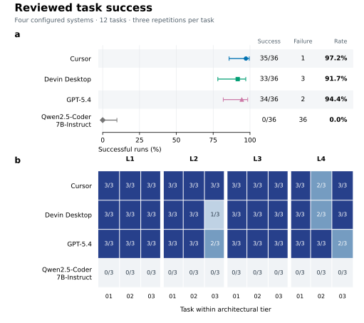

# Quantitative results and thesis figures

The current nine quantitative figures correspond to Figures 8–16 in the thesis draft of 7 October 2026. They use the same 144 selected valid observations and reviewed scoring as the published analysis. Task briefs, prompts and illustrative interactions remain in the thesis appendix. The figure update published on 9 October changes presentation, not experimental records or statistical conclusions.

## Reproduce

From the repository root, render the complete current figure set from the committed tables and dataset:

```sh
python -m pip install -r analysis/requirements-statistics.txt
python analysis/build_dataset.py --check
python analysis/failure_summary.py --check
python analysis/plot_core_success.py
python analysis/plot_secondary_outcomes.py
```

The first plotting script produces Figures 8–10; the second produces Figures 11–16. Both resolve data paths relative to the repository and write PDF, SVG and 300 dpi PNG files to `results/figures/`. No private workspace paths, comparison-sheet images or system-specific fonts are required. Python 3.12.14, NumPy 2.3.5 and Matplotlib 3.10.8 were used. Jupyter is optional.

To regenerate the numerical tables as well, run the following before plotting:

```sh
python analysis/core_success.py
python analysis/secondary_outcomes.py
python analysis/failure_summary.py
python -m unittest discover -s analysis -p "test_*.py"
```

The [core notebook](../analysis/core_success.ipynb) and [secondary notebook](../analysis/secondary_outcomes.ipynb) call these same analysis and plotting scripts. The failure-summary command reproduces aggregates from the retained codes, not the qualitative adjudication itself.

Input: `data/main/analysis_dataset.csv` from commit `0bf95f7630e8c87e6ccb95292ed34de02296b4e1`, 144 valid selected slots, including failures. The [core manifest](core_success_manifest.json) records the numerical-analysis inputs, script, plan, runtime and seed; the [secondary manifest](secondary_manifest.json) records the secondary analysis. These original numerical provenance records are unchanged by the figure update. The seed conversion uses the first eight SHA-256 bytes as an unsigned big-endian integer with NumPy PCG64; this conversion was not specified in the frozen plan. Python 3.12.14 differs from the planned 3.12.13; the frozen plan is retained.

## Thesis figure map

Every filename below has `.pdf`, `.svg` and `.png` versions in [figures](figures/). Figure numbers refer to the 7 October draft.

| Figure | Content | Filename stem | Published data source |
|---|---|---|---|
| 8a/b | Overall success and task success | `success_summary` | `tables/success_summaries.csv` |
| 9 | Success by architectural tier | `success_by_tier` | `tables/success_summaries.csv` |
| 10 | Paired success-rate differences | `success_pairwise` | `tables/pairwise_success.csv` |
| 11 | Elapsed time by outcome population | `elapsed_time` | `../data/main/analysis_dataset.csv` |
| 12 | Functional and architectural diagnostics | `diagnostic_checks` | `tables/task_diagnostics.csv` |
| 13 | L3/L4 success without clarification responses | `robustness` | `tables/robustness.csv` |
| 14 | Stages of unsuccessful runs | `failure_stages` | `tables/failure_coding.csv`, `tables/failure_stage_counts.csv` |
| 15 | Evidence-supported failure categories | `failure_categories` | `tables/failure_coding.csv`, `tables/failure_category_counts.csv` |
| 16 | Original/reviewed scoring sensitivity | `scoring_sensitivity` | `tables/success_summaries.csv` |

Figure 8 replaces the separate `success_overall` and `success_by_task` assets. Their earlier versions remain in Git history. Captions for Figures 11–13 and 16 are in [secondary results](secondary_results.md); Figures 14–15 are in [failure analysis](failure_analysis.md).

## Method and reporting boundary

Main figures use the unified reviewed scoring version `public-contract-audit/2026-09-26`. Success requires normal submission plus every applicable functional and architectural check passing. Original-score summaries and comparisons are retained in the same CSV tables, labelled by scoring version, as the baseline for subsequent sensitivity reporting.

Success summaries use descriptive 95% Wilson intervals: n=36 runs per system overall, n=9 per system/tier, n=3 per system/task. These intervals do not adjust for within-task dependence and must not substitute for the paired inferential analysis. Each tier contains only three tasks; tier differences do not establish a causal effect of complexity.

Pairwise effects are system A minus system B success rates. Ten thousand bootstrap resamples draw 12 tasks with replacement; all systems and three repetitions travel together within each sampled task. Percentile intervals use the 2.5th and 97.5th percentiles (NumPy linear quantiles). All 4,096 task-level A/B label swaps are enumerated for a two-sided exact test, counting ties using integer success-count differences. Holm adjustment covers six contrasts separately within each scoring version. Bootstrap intervals are unadjusted 95% intervals, not simultaneous intervals or inversions of the exact tests; their endpoints and Holm p values need not give identical threshold decisions.

Inference is exploratory and bounded to this benchmark and the configured systems. Non-significance is not equivalence. Qwen's 0/36 is a valid end-to-end outcome and does not isolate model reasoning from interface/tool use. No claim that all Qwen failures occurred during file navigation is made; the completed [failure analysis](failure_analysis.md) distinguishes observable stages and evidence coverage.

## Main-text figures and captions

### Figure 8 — Overall and task-level reviewed success



**Caption.** Reviewed end-to-end success for four configured coding systems. Panel a reports successes out of 36 valid observations per system, failures and rates; horizontal bars are descriptive 95% Wilson intervals. Panel b retains all 12 task × four system cells, annotated with successful repetitions out of three. Tasks follow L1–L4 and 01–03 order, with no clustering or exclusions. All valid failures remain in the denominators. Wilson intervals do not account for within-task dependence; paired inference uses 12 tasks. Source: [success_summaries.csv](tables/success_summaries.csv), reviewed overall and task rows.

### Figure 9 — Success by architectural tier


**Caption.** Reviewed success across four tier panels, with system rows in fixed order. Each point represents successes out of nine observations (three tasks × three repetitions) for one system/tier; horizontal bars are descriptive 95% Wilson intervals and labels give counts. No tasks or unsuccessful observations are omitted. Source: [success_summaries.csv](tables/success_summaries.csv), reviewed tier rows. The intervals do not adjust for within-task dependence, and three distinct tasks per tier do not establish a causal effect of complexity.

### Figure 10 — Paired success-rate differences


**Caption.** Reviewed success-rate differences, system A minus B, in percentage points. Points aggregate 12 paired tasks with three repetitions per system/task; horizontal bars are unadjusted 95% percentile task-bootstrap intervals from 10,000 resamples. The dashed line marks zero; aligned columns report the differences in percentage points and Holm-adjusted p values. Exact two-sided task-label-swap tests enumerate 4,096 assignments; Holm correction covers the six comparisons. Adjusted p=1.000 for comparisons among Cursor, Devin Desktop and GPT-5.4; adjusted p=0.0029296875 for each comparison with Qwen. Qwen abbreviates Qwen2.5-Coder-7B-Instruct. Source: `tables/pairwise_success.csv`, reviewed rows.

## Results draft

Across the 144 selected valid observations, reviewed success was 35/36 for Cursor (97.2%; descriptive 95% Wilson interval 85.8–99.5%), 34/36 for GPT-5.4 (94.4%; 81.9–98.5%), 33/36 for Devin Desktop (91.7%; 78.2–97.1%) and 0/36 for Qwen2.5-Coder-7B-Instruct (0%; 0–9.6%). Cursor, Devin Desktop and GPT-5.4 each succeeded in all nine L1 and all nine L3 observations. L2 counts were 9/9, 7/9 and 8/9, respectively; each achieved 8/9 on L4. Qwen had no successful observations in any tier.

The observed differences among Cursor, Devin Desktop and GPT-5.4 ranged from −2.8 to 5.6 percentage points across the specified contrasts; none was detected as significant by the task-paired exact tests after Holm correction (all adjusted p=1.000). Each exceeded the configured Qwen system by 91.7–97.2 percentage points (all adjusted p=0.0029296875). These findings do not establish equivalence among the three higher-success systems or identify an isolated model-capability effect. Generalisation is limited by the 12 benchmark tasks and the interfaces, tools and execution controls used.

## Related results

[Secondary results](secondary_results.md) report timing, diagnostic correctness, clarification, L3/L4 success without evaluator responses and scoring sensitivity. [Failure analysis](failure_analysis.md) covers all 42 reviewed unsuccessful runs with a public evidence index, run-level codes, two figures and reproducible category/stage counts. Quantitative analysis, failure coding and thesis Results integration are complete. The full thesis PDF and internal handoff are outside this repository update.
