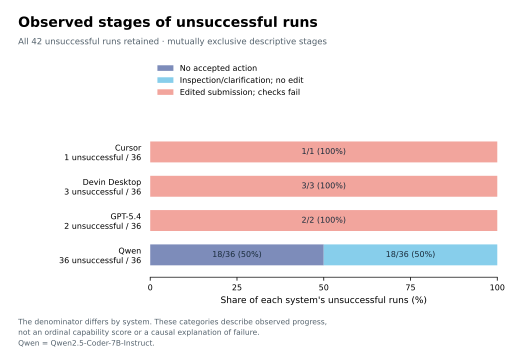
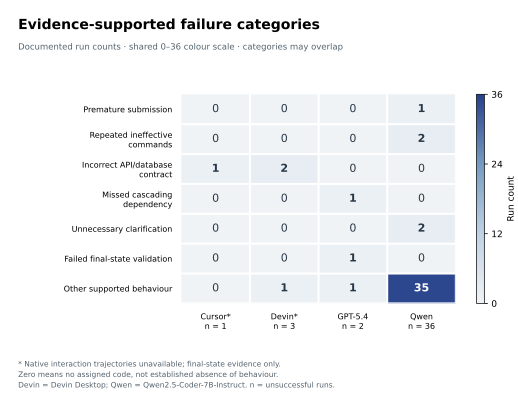

# Observable failure analysis

All 42 unsuccessful observations under `public-contract-audit/2026-09-26` are included: Cursor 1, Devin Desktop 3, GPT-5.4 2 and Qwen 36. This is post-collection descriptive coding. It does not change the dataset, scoring, exclusions or agent executions.

## Evidence and reproduction

- [Run-level coding](tables/failure_coding.csv): observations, categories, stage, coverage and original archive references.
- [Evidence index](failure_evidence_index.json): public selected-run sources, compact observed-event extracts and explicitly distinguished retained-archive references.
- [Category counts](tables/failure_category_counts.csv) and [stage counts](tables/failure_stage_counts.csv).

Run `python analysis/failure_summary.py` to regenerate aggregates, or append `--check` to verify them. This standard-library script verifies coverage against the selected dataset and checks identities and evidence-index links. It reproduces summaries from the adjudicated codes; it does not independently reproduce qualitative interpretation or execute agents. Full original transcripts remain outside this curated release. Private archive references identify retained evidence and are not advertised as downloadable files.

## Coding rules

Category families follow the analysis plan; the following operational definitions were refined after observing outcomes. Categories may overlap. No independent second-coder agreement estimate is available. An absent code does not demonstrate absence of the behaviour.

| Category | Observable criterion | Runs |
|---|---|---:|
| Premature submission | Submission without an executed repair; not every failed submitted run | 1 |
| Repeated ineffective commands | At least two executed ineffective inspection attempts; unexecuted prose is excluded | 2 |
| Incorrect API/database assumption | A visible contract-violating change, without inferring an internal belief | 3 |
| Missed cascading dependency | Local repair with a remaining or introduced linked-service failure | 1 |
| Unnecessary clarification | Recorded requests on complete-brief tasks | 2 |
| Failed final-state validation | Explicit unsuccessful validation commands followed by submission | 1 |
| Other supported behaviour | 35 no-progress/protocol failures and two residual storage/configuration failures | 37 |

Four unsuccessful native-IDE runs have no usable interaction transcript. Their codes describe final changes and test behaviour, not unseen debugging decisions. Native accepted-action and path-error counts are missing, not zero.

## Findings and interpretation

Eighteen Qwen runs had no accepted action; 18 had inspection or clarification actions without a final task-code diff. All 36 final diffs are empty. Fifteen contain actual missing-path errors. Thirty-five stopped at the no-progress limit; L3-02 repetition 3 submitted with zero accepted actions. These are valid end-to-end failures of the configured system. They do not isolate the model's ability to modify code from tool use, interface and execution policy, and do not demonstrate that every failure was a path-resolution failure.

The six edited unsuccessful submissions concern working-directory-dependent persistence, a Dockerfile-only configuration change, replacement-import semantics changed to merging, invalid status accepted, supplied status ignored, and a remaining frontend/proxy HTTP 404 after repairing a database hostname. The last run also records failed pytest/npm validation commands before submission. Detailed observable examples are in thesis Appendix D.9; aggregate categories and stage interpretation are in the main Results.

## Figure 14 — Observed stages of unsuccessful runs

**Caption.** Observable stages for all 42 reviewed unsuccessful runs. Each bar sums to 100% of that system's failures: Cursor n=1, Devin Desktop n=3, GPT-5.4 n=2 and Qwen n=36. Segments are mutually exclusive: no accepted action; inspection or clarification without a final task-code edit; edited submission failing checks. Labels give counts and within-system percentages. The unequal denominators mean equal-length bars do not represent equal failure rates. Stages describe recorded progress, not causes or an ordinal capability score. Sources: [failure_coding.csv](tables/failure_coding.csv) and [failure_stage_counts.csv](tables/failure_stage_counts.csv).

## Figure 15 — Evidence-supported failure categories

**Caption.** Documented category counts for the same 42 unsuccessful runs, with per-system failure denominators beneath the columns. Colour uses a shared linear 0–36 count scale; categories may overlap, and no clustering or rate normalisation is applied. Zero means no assigned evidence-supported code, not demonstrated absence of behaviour. Asterisks mark the four native-IDE failures without usable interaction trajectories. Other supported behaviour comprises 35 Qwen no-progress/protocol terminations and two storage/configuration failures. Counts are descriptive; no inferential comparisons are made. Sources: [failure_coding.csv](tables/failure_coding.csv) and [failure_category_counts.csv](tables/failure_category_counts.csv).

Run `python analysis/plot_secondary_outcomes.py` from the repository root to produce these two figures together with Figures 11–13 and 16. It checks the stage and category aggregations against the published count tables before drawing them. Each figure has PDF, SVG and 300 dpi PNG exports.

## Manuscript alignment

The current thesis Results contains nine quantitative figures (8–16), including these two failure displays and the combined success figure, alongside the clarification table. Methods state the uniform scoring-review policy. Appendix D.8 retains task-specific corrections and original comparisons; D.9 contains failure coding and illustrative interactions. The [figure map](README.md#thesis-figure-map) gives all filenames. This repository publishes the research data, figures and reproducible scripts; the full thesis PDF and internal handoff are not included in this update.
