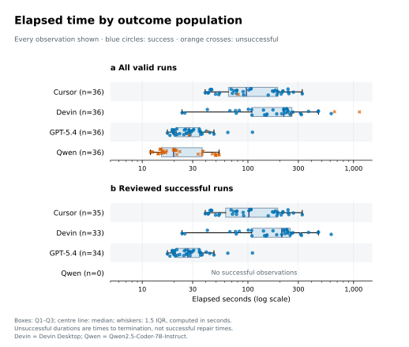
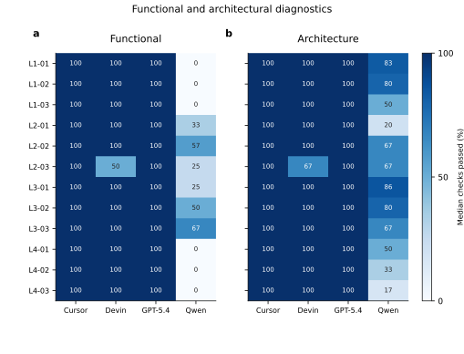
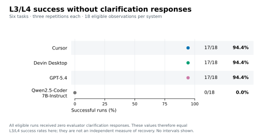
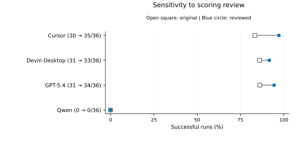

# Secondary outcomes and scoring sensitivity

These analyses use the same 144 selected valid observations as the [core analysis](README.md). Reviewed scoring is primary; original scores remain available. Results figures and the compact clarification table are intended for the thesis main text. Task briefs, prompts, interaction examples and detailed correction records belong in the appendix. No new runs or scoring changes were made.

## Reproduction

From the repository root, install `analysis/requirements-statistics.txt`, then run:

```sh
python analysis/core_success.py
python analysis/secondary_outcomes.py
python analysis/plot_secondary_outcomes.py
python -m unittest discover -s analysis -p test_secondary_outcomes.py
```

The [notebook](../analysis/secondary_outcomes.ipynb) calls the same scripts. The [manifest](secondary_manifest.json) records input and analysis-script hashes and actual Python/NumPy versions. Quantiles use NumPy's linear method. These secondary outcomes are descriptive; no additional hypothesis-test family is introduced. Missing denominators are reported as NA, never replaced by zero.

## Elapsed time

| System | All valid runs, median [Q1, Q3] seconds | Reviewed successful runs, median [Q1, Q3] seconds |
|---|---:|---:|
| Cursor | 96.70 [65.46, 190.95], n=36 | 102.27 [61.61, 191.34], n=35 |
| Devin Desktop | 218.70 [108.96, 260.54], n=36 | 209.00 [108.36, 251.38], n=33 |
| GPT-5.4 | 27.72 [21.03, 34.98], n=36 | 27.01 [20.66, 34.75], n=34 |
| Qwen2.5-Coder-7B-Instruct | 19.82 [15.19, 36.96], n=36 | NA, n=0 |

All-valid duration measures time to termination, including unsuccessful early stops. It is not time to successful completion. Qwen's short durations therefore do not demonstrate superior efficiency. Successful-only summaries are conditional on different sets of completed tasks and are not a matched causal speed comparison. Recorded elapsed time also reflects the configured interfaces and execution controls, not isolated model latency.



**Caption.** Recorded elapsed seconds for all valid runs (a) and the reviewed successful subset (b). Boxes show Q1–Q3, horizontal lines show medians and whiskers reach the most extreme observations within 1.5 IQR of the quartiles, calculated in seconds before displaying a logarithmic axis. Every observation, including outliers, is plotted; deterministic horizontal offsets only separate points. Blue circles denote reviewed success and orange crosses unsuccessful outcomes. Counts are shown under each system; no successful Qwen duration is estimable. Source: `data/main/analysis_dataset.csv`; summaries: [elapsed_time.csv](tables/elapsed_time.csv). Both scoring versions are retained in that table.

## Functional and architectural diagnostics

For each run, the proportion is passed/applicable checks, separately for functionality and architecture. Summaries weight runs equally, rather than pooling checks across tasks with different check counts. Cursor, Devin Desktop and GPT-5.4 each have reviewed overall median 100% [100%, 100%] for both measures; these ceiling summaries do not imply that every run passed. Qwen has functional median 12.5% [0%, 37.5%] and architectural median 66.7% [45.8%, 80.0%]. Checks can already pass in a faulty starting repository, so a partial check score does not itself demonstrate a successful agent modification.



**Caption.** Reviewed median proportion of applicable checks passed across three repetitions for every task/system, separately for functional checks (a) and architectural checks (b). Cells show percentages rounded to whole numbers; color uses the unrounded median with a common 0–100% scale. There is no clustering, pooling of denominators or combined weighted score. Medians can conceal a single failed repetition; consult the task success figure and per-run records alongside this figure. Sources: [task_diagnostics.csv](tables/task_diagnostics.csv), with original/reviewed medians and quartiles; [diagnostic_correctness.csv](tables/diagnostic_correctness.csv) contains system summaries.

## Clarification behavior

| System | Requests / authorized / responses | Opportunity capture | Request precision | Unnecessary-request rate |
|---|---:|---:|---:|---:|
| Cursor | 0 / 0 / 0 | 0/3 (0%) | NA (no requests) | 0/33 (0%) |
| Devin Desktop | 0 / 0 / 0 | 0/3 (0%) | NA (no requests) | 0/33 (0%) |
| GPT-5.4 | 3 / 3 / 3 | 3/3 (100%) | 3/3 (100%) | 0/33 (0%) |
| Qwen2.5-Coder-7B-Instruct | 8 / 0 / 0 | 0/3 (0%) | 0/8 (0%) | 2/33 (6.1%) |

Opportunity capture counts runs with at least one authorized request among the three L2-02 repetitions per system. Precision is authorized requests divided by all clarification requests, aggregating request counts rather than averaging per-run ratios. Unnecessary-request rate counts complete-brief runs with any clarification request, among 33 such runs per system. Permission prompts are not clarification requests. Only one distinct task supplies deliberate clarification opportunities, so these figures do not establish general clarification competence. Source: [clarification.csv](tables/clarification.csv). The same recorded behavior applies under both scoring versions.

## L3/L4 success without evaluator clarification responses



**Caption.** Reviewed normal-submission success with every applicable check passed and zero evaluator clarification responses, among 18 L3/L4 runs per system (six tasks × three repetitions). Points are descriptive rates with counts in labels; no inferential intervals are shown. Cursor, Devin Desktop and GPT-5.4 each achieve 17/18 (94.4%); Qwen achieves 0/18. All 72 eligible runs received zero clarification responses, so this measure coincides with L3/L4 success in this dataset. It supplies no independent evidence of recovery ability or a causal effect of withholding assistance. Source: [robustness.csv](tables/robustness.csv).

## Original-versus-reviewed scoring sensitivity

| System | Original success | Reviewed success | Change, percentage points |
|---|---:|---:|---:|
| Cursor | 30/36 (83.3%) | 35/36 (97.2%) | +13.9 |
| Devin Desktop | 31/36 (86.1%) | 33/36 (91.7%) | +5.6 |
| GPT-5.4 | 31/36 (86.1%) | 34/36 (94.4%) | +8.3 |
| Qwen2.5-Coder-7B-Instruct | 0/36 (0%) | 0/36 (0%) | 0.0 |

Ten observations change from unsuccessful to successful (five Cursor, two Devin Desktop, three GPT-5.4); none changes in the opposite direction. Seventeen observations have changed diagnostic check counts or denominators, which need not change binary success. The [144-row paired table](tables/scoring_transitions.csv) retains original/reviewed success, stop reason and passed/applicable counts. Specific corrections and their public-contract rationale remain in the [evaluation-review documentation](../docs/evaluation-review.md).



**Caption.** Paired overall success proportions under original (open square) and reviewed (blue circle) scoring, using the same 36 observations per system. Lines connect scoring versions, not new executions; labels report original → reviewed successful counts. Coincident marks indicate no change. Original/reviewed descriptive 95% Wilson intervals are retained in `tables/success_summaries.csv`; this figure emphasizes within-dataset changes rather than duplicating those intervals.

The observed ordering among the three higher-success systems changes: originally Devin Desktop and GPT-5.4 tie above Cursor; after review Cursor is highest, followed by GPT-5.4 and Devin Desktop. However, none of their three pairwise differences is detected by the task-paired exact test after Holm adjustment under either scoring version (all adjusted p=1). All three comparisons with Qwen remain detected: original adjusted p values are 0.0078125 (Cursor), 0.0048828125 (Devin Desktop) and 0.0029296875 (GPT-5.4); each reviewed comparison has adjusted p=0.0029296875. Thus the broad separation from Qwen is insensitive to these corrections, while the descriptive ordering among the other systems is sensitive. Non-significance does not establish equivalence. See [pairwise_sensitivity.csv](tables/pairwise_sensitivity.csv) for paired effects, task-bootstrap intervals and raw/adjusted p values, using the unchanged [core methods](README.md).

All-valid duration and recorded clarification behavior are unchanged. Successful-only duration changes because membership changes, not because any execution became faster or slower. Qwen's architectural median changes from 61.9% to 66.7%, while its functional median remains 12.5%; partial diagnostic improvements do not imply successful code repair. Original L3/L4 no-response success counts are Cursor 12/18, Devin Desktop 15/18, GPT-5.4 15/18 and Qwen 0/18, versus reviewed 17/18 for each of the first three and 0/18 for Qwen. Both versions of every scoring-dependent secondary table are retained.

## Remaining work

Evidence-based failure-cause coding, selection of accurately labelled interaction examples and thesis integration remain pending. These results do not assert that every Qwen failure is a navigation failure, and do not rank incomparable or missing monetary-cost measurements. Results charts belong in the main text; detailed correction records and interactions belong in the appendix. The conclusion should discuss the study-wide findings and limitations rather than single out one corrected task.

## Subsequent completion

[Evidence-based failure coding](failure_analysis.md) and thesis Results integration are now complete. Full native interaction traces remain unavailable for the four native unsuccessful observations; final-state evidence supports their coding.
